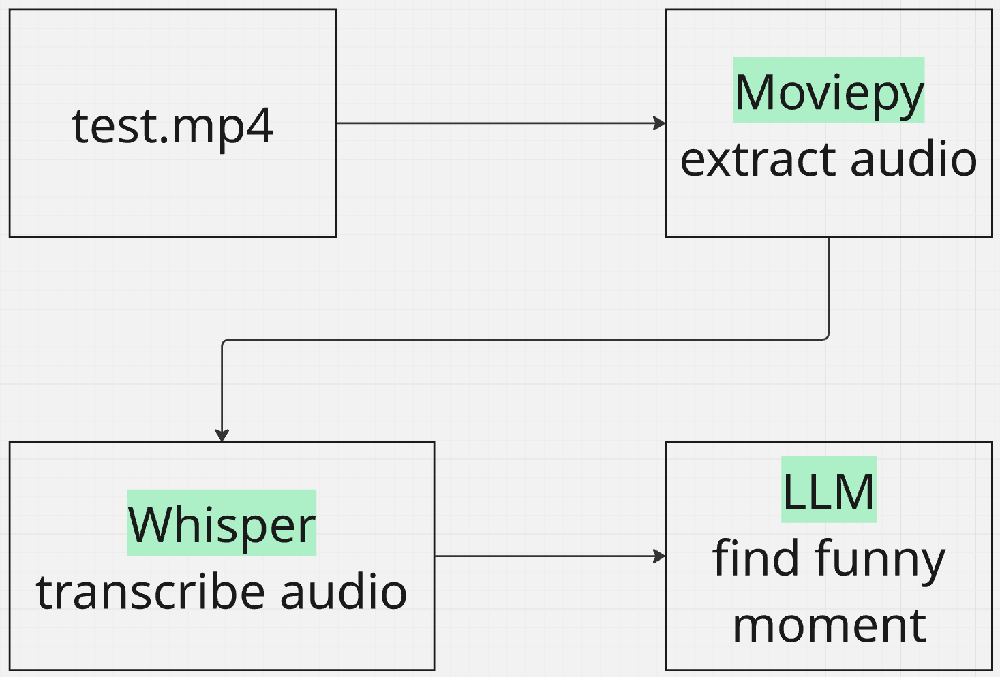

# FunnyMomentCaptureAI

FunnyMomentCaptureAI is a Python-based tool designed to automatically identify and extract "funny moments" from video files. It leverages speech-to-text transcription, Large Language Models (LLMs) for content analysis, and outputs the identified moments with timestamps and reasons in a JSON format, allowing users to manually review and clip the videos.

## Features

*   **Audio Extraction**: Extracts audio tracks from video files.
*   **Speech-to-Text Transcription**: Transcribes audio into text using Whisper.
*   **LLM-Powered Moment Identification**: Utilizes a Large Language Model (LLM) to analyze transcripts and pinpoint funny, humorous, or engaging segments.
*   **Timestamped Output**: Provides start and end timestamps (HH:MM:SS) for each identified moment.
*   **Reasoning**: Explains why the LLM considered a particular segment funny.
*   **JSON Output**: Saves all identified moments in a structured JSON file for easy review.
*   **Configurable LLM**: Supports both LM Studio (for local LLMs) and NVIDIA NIM (for cloud-based LLMs).

## Workflow

Here's a high-level overview of how FunnyMomentCaptureAI processes a video:



## Installation

### Prerequisites

Before you begin, ensure you have the following installed:

*   **Python 3.9+**: [Download Python](https://www.python.org/downloads/)
*   **uv**: A fast Python package installer and resolver. Install it using `pip install uv`.
*   **Git**: For cloning the repository.
*   **FFmpeg**: Essential for audio extraction and video processing.
    *   **Windows**: You can download a build from [ffmpeg.org](https://ffmpeg.org/download.html) and add it to your system's PATH.
    *   **macOS**: `brew install ffmpeg`
    *   **Linux**: `sudo apt update && sudo apt install ffmpeg`
*   **LM Studio (Optional, for local LLM)**: If you plan to use a local LLM, download and install [LM Studio](https://lmstudio.ai/). You'll need to download a compatible model (e.g., Gemma) within LM Studio and run its local server.
*   **NVIDIA NIM (Optional, for cloud LLM)**: If you plan to use NVIDIA NIM, you'll need an API key from NVIDIA.

### Steps

1.  **Clone the repository**:
    ```bash
    git clone https://github.com/your-username/FunnyMomentCaptureAI.git
    cd FunnyMomentCaptureAI
    ```

2.  **Create a virtual environment (recommended)**:
    ```bash
    python -m venv venv
    # On Windows
    .\venv\Scripts\activate
    # On macOS/Linux
    source venv/bin/activate
    ```

3.  **Install dependencies**:
    ```bash
    uv sync
    ```

4.  **Configure the `.env` file**:
    Copy the `.env.example` file to `.env` and update the settings:
    ```bash
    cp .env.example .env
    ```
    Open `.env` in a text editor and configure the following:

    *   **`LLM_PROVIDER`**: Choose `"lm_studio"` for local LLMs or `"nvidia"` for NVIDIA NIM.
    *   **`LM_STUDIO_BASE_URL`**, `LM_STUDIO_API_KEY`, `LM_STUDIO_MODEL_NAME`: If using LM Studio, ensure these match your LM Studio server configuration.
    *   **`NVIDIA_BASE_URL`**, `NVIDIA_API_KEY`, `NVIDIA_MODEL_NAME`: If using NVIDIA NIM, provide your API key and desired model.
    *   **`WHISPER_MODEL_SIZE`**: The size of the Whisper model to use (e.g., `large-v3`).
    *   **`WHISPER_INITIAL_PROMPT`**: System prompt for whisper
    *   **`INPUT_VIDEO_PATH`**: Set this to the path of the video file you want to analyze.
    *   **`OUTPUT_DIR`**: Directory where the JSON output will be saved.
    *   **`HF_TOKEN`**: Your Hugging Face token, if required by your chosen Whisper model or other components.

## Usage

After installation and configuration, run the main script:

```bash
uv run main.py
```

The script will:
1.  Extract audio from your specified `INPUT_VIDEO_PATH`.
2.  Transcribe the audio.
3.  Analyze the transcript using the configured LLM to find funny moments.
4.  Save the identified moments, including their start/end times (HH:MM:SS) and reasons, into a JSON file in the `OUTPUT_DIR`.

You can then review the JSON file and manually clip the video segments using your preferred video editing software.
